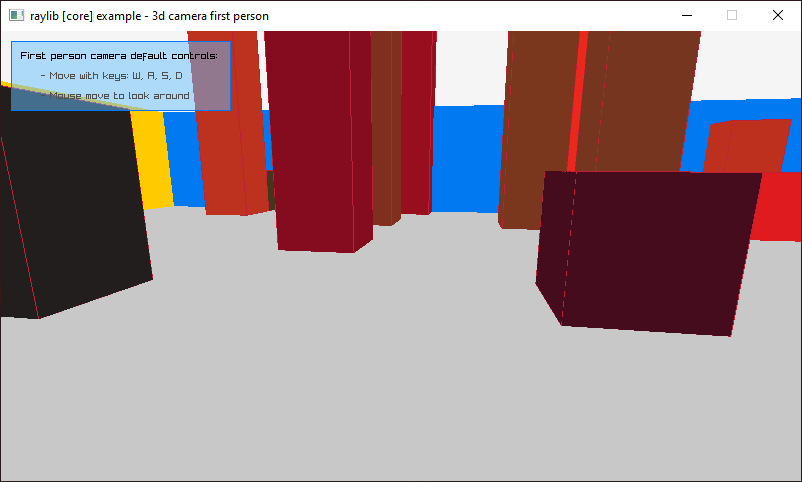
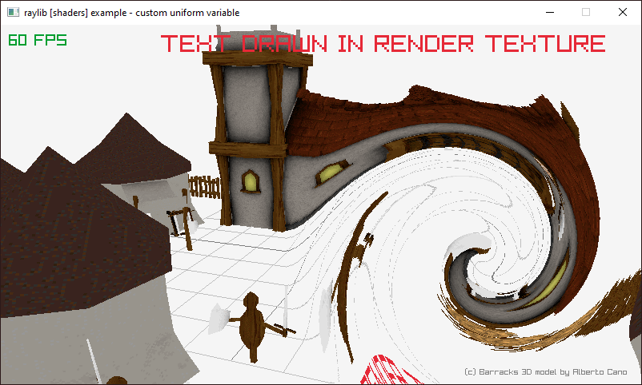
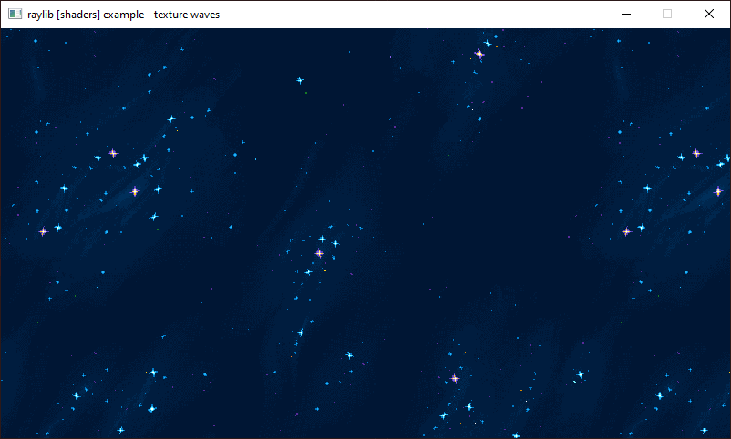
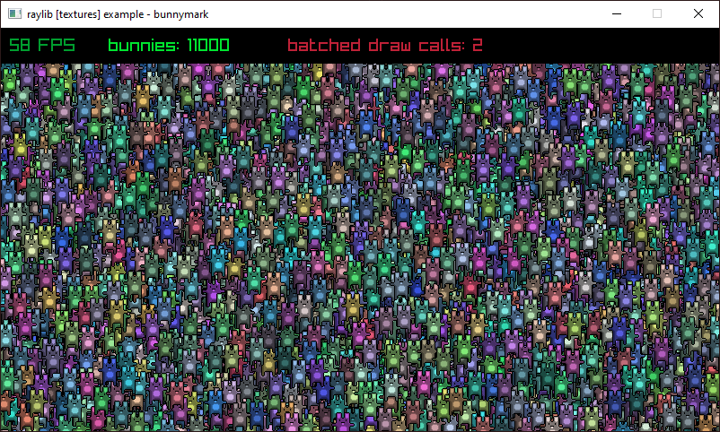

# raylib-jai bindings

[Raylib](https://www.raylib.com/) is a minimal gamedev library for C and this repository has a script for automatically generating Jai bindings from `raylib.h`.
 
There are also examples--direct Jai ports of the [raylib examples](https://www.raylib.com/examples.html).

<a href="examples/core_3d_camera_first_person.jai"></a>
<a href="examples/shaders_custom_uniform.jai"></a>
<a href="examples/shaders_texture_waves.jai"></a>
<a href="examples/textures_bunnymark.jai"></a>

There are more than shown here ported in the [examples/](examples) folder.

## Minimal example

```
#load "path/to/raylib.jai";

main :: () {
    InitWindow(800, 450, "raylib example");
    defer CloseWindow();
    while !WindowShouldClose() {
        BeginDrawing();
        defer EndDrawing();
        ClearBackground(RAYWHITE);
        DrawText("raylib + jai", 190, 200, 20, LIGHTGRAY);
    }
}
```


## Building the examples

Run `compile_examples.bat` with `jai` on your PATH.

Run the example `.exe` files from the `examples/` directory.

## Differences from C raylib

* Some functions which take enum arguments (like `SetConfigFlags` for example) have their argument types changed from C's `int` (or Jai's `s32`) to the actual enum type. Consequently, you can call them like `SetConfigFlags(.FLAG_FULLSCREEN_MODE);`

## Regenerating the bindings

A `python` script [generator.py](generator.py) reads `raylib.h` and generates [raylib.jai](raylib.jai).


